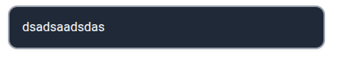
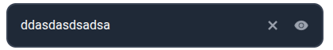
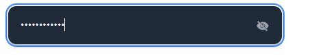
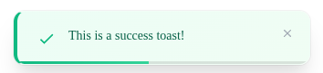
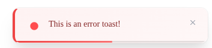
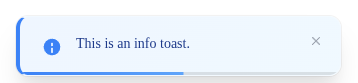
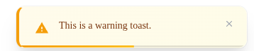
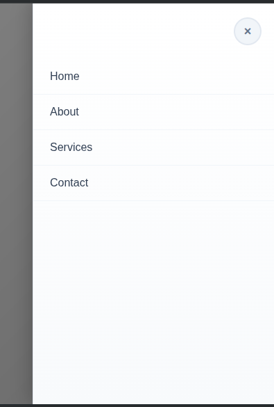
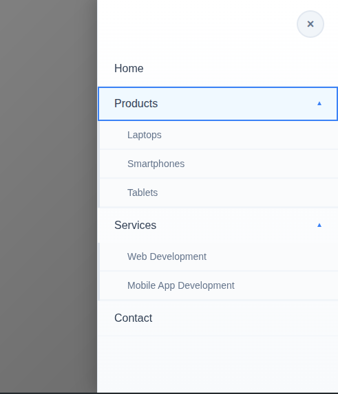

# React Component Library with Storybook

This project is a small React component library built with Vite, TypeScript, and Storybook, as part of a test assessment.

## 🚀 Setup and Running

1.  **Install dependencies:**

    ```bash
    npm install --legacy-peer-deps
    ```

2.  **Run Storybook:**
    ```bash
    npm run storybook
    ```
    This will open Storybook in your browser, where you can view and interact with the components.

## 🧩 Components

This library includes the following components:

### 📥 1. Input Component

A versatile input component with the following features:

- **Types:** Can be used as a `text`, `password`, or `number` input.
- **Password Visibility:** When `type="password"`, an eye icon is shown to toggle the visibility of the password.
- **Clearable:** When `clearable={true}`, an "X" button appears to clear the input's content.

### 🔔 2. Toast Component

A notification component to display brief messages.

- **Appearance:** Appears at the bottom right of the screen.
- **Auto-dismiss:** Automatically dismisses after a specified duration (default is 3 seconds).
- **Transitions:** Includes a smooth slide-in and fade-out transition.
- **Variants:** Comes in four types: `success`, `error`, `info`, and `warning`.
- **Manual Close:** An optional close button is available to dismiss the toast manually.

### 📚 3. Sidebar Menu Component

A sliding sidebar menu for navigation.

- **Animation:** Slides in from the right side of the screen.
- **Nested Menus:** Supports nested submenus that can be expanded and collapsed.
- **Close on Overlay Click:** The menu can be closed by clicking on the background overlay.

## 📸 Screenshots

### Input Component





### Toast Component






### Sidebar Menu Component



